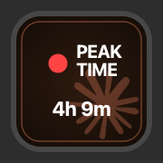
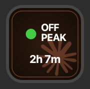

# Claude Peak Ticker

A Stream Deck plugin that shows whether Claude is currently in peak or off-peak hours, with a live countdown to the next status change. Powered by [promoclock.co](https://promoclock.co).

 

Press the button to open `claude-spend` for a detailed spending breakdown. On macOS it launches in Terminal, on Windows it opens in Command Prompt.

## How it works

During peak hours, Claude Code rate limits drain faster. This plugin polls the [promoclock.co API](https://promoclock.co/api/status) every 5 minutes and shows the current status on your Stream Deck button with a countdown timer to the next change. No API keys or local file parsing needed.

## What you see

| Button state | Meaning |
|---|---|
| Red circle + PEAK TIME | Peak hours active, limits drain faster |
| Green circle + OFF PEAK | Off-peak hours, normal rate limits |
| Countdown timer | Time remaining until the status changes |
| `...` | Waiting for first API response |

## Install

```bash
git clone https://github.com/teamvrotek/claude-peak-streamdeck-ticker.git
cd claude-peak-streamdeck-ticker
./build.sh
```

Double-click the `.streamDeckPlugin` file in `Release/` to install.

## Settings

| Setting | Default | What it does |
|---|---|---|
| Color Theme | Claude (terracotta) | Button color scheme |
| Poll Interval | 30 seconds | How often the button display refreshes |

The API is polled every 5 minutes regardless of the display refresh interval.

## Color themes

5 themes: Claude (terracotta), Blue, Green, Purple, Teal. All feature the Claude logo watermark in the background.

## Troubleshooting

| Button shows | What's wrong |
|---|---|
| `...` | Waiting for the first response from promoclock.co. Should resolve within a few seconds. |
| `--` | Could not reach promoclock.co. Check your internet connection. |

## Requirements

- Stream Deck 6.9+
- macOS 10.15+ or Windows 10+

## Privacy

The only network request is a periodic check to [promoclock.co/api/status](https://promoclock.co/api/status) for peak hour detection. No authentication required, no user data sent.

## Disclaimer

This plugin is provided as-is, without warranty of any kind. Peak hour data comes from promoclock.co and may not always reflect the actual state of Claude's rate limiting.

## Credits

- [claude-spend](https://github.com/writetoaniketparihar-collab/claude-spend) by Aniket Parihar, the CLI tool that opens when you press the button
- [promoclock](https://github.com/onursendere/promoclock) by Onur Sendere, the API that provides peak/off-peak hour data

## License

MIT, see [LICENSE](LICENSE).

Made by [VROTEK](https://github.com/TeamVrotek).
