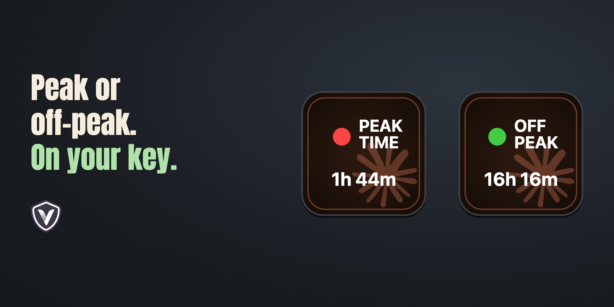
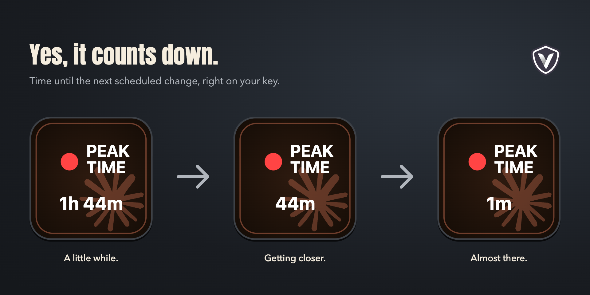
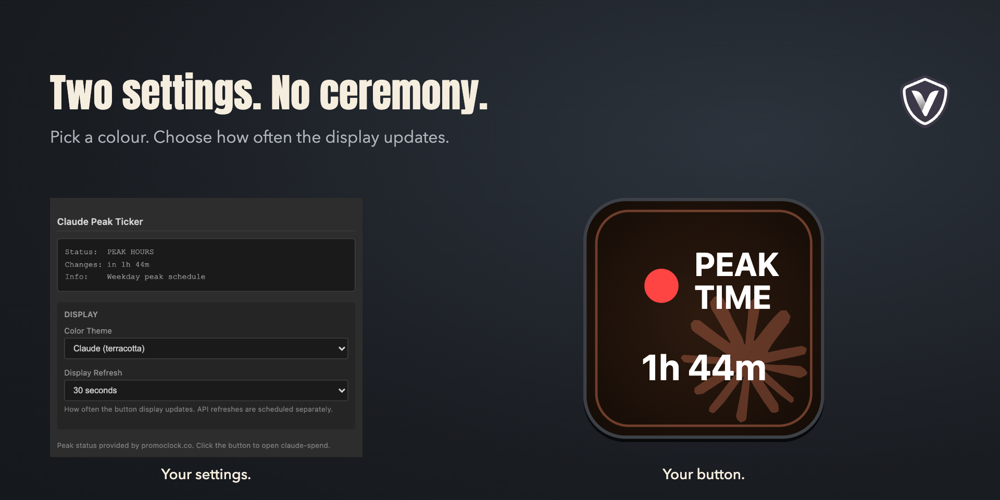
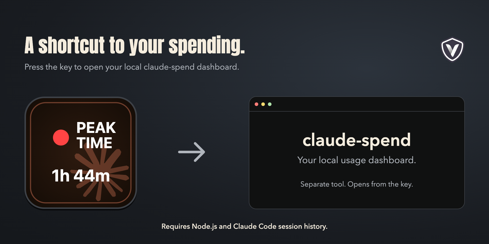
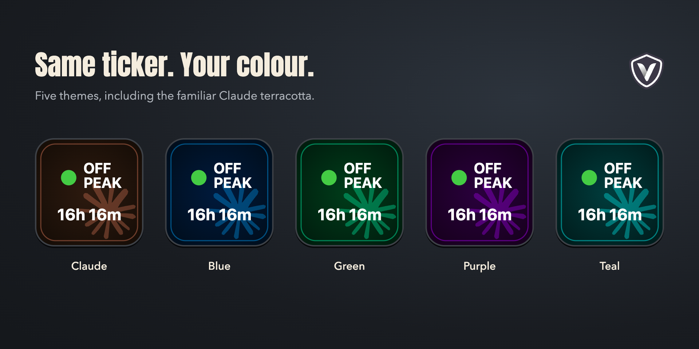

<p align="center">
  
</p>

<h1 align="center">Claude Peak Ticker</h1>

<p align="center"><strong>Version 1.3</strong></p>

See Claude’s peak and off-peak schedule from promoclock.co on your Stream Deck, with a countdown to the next change. Choose from five colour themes and set how often the display updates.

Press the key to open your local claude-spend dashboard and take a closer look at your Claude Code usage. This optional shortcut needs Node.js and local Claude Code session history.

Requires Stream Deck 6.9+, macOS 13+ or Windows 11 (64-bit).

If you find this useful, follow @teamvrotek on GitHub or Instagram. Your support helps us feel more special, thank you.



*All previews use sample data.*

## Install and set up

You need **Stream Deck 6.9+** on **macOS 13+** or **Windows 11**, following [Elgato's supported platforms for Stream Deck 6.9](https://help.elgato.com/hc/en-us/articles/34904105205777-Elgato-Stream-Deck-6-9-Release-Notes). The ticker uses Stream Deck's bundled Node.js runtime. You do not need to install Node.js to display the schedule.

1. Install from [Elgato Marketplace](https://marketplace.elgato.com/product/claude-peak-ticker-f1446a1e-34a1-4476-b1b5-97d55575c334). To create the installer yourself, see [Build from source](#build-from-source).
2. Find **Claude Peak Ticker** in the action list and drag **Peak ticker** onto a key.
3. Choose a colour theme and how often the display should update.

No API key or Claude sign-in is needed for the ticker.

## See the next change

The key shows the current schedule period and the time remaining until the next change:

| Display | Meaning |
|---|---|
| Red indicator and PEAK TIME | The schedule is in its peak period |
| Green indicator and OFF PEAK | The schedule is in its off-peak period |
| Countdown | Hours and minutes until the next scheduled change |



These are schedule labels from promoclock.co. Check Claude itself for your account's remaining usage and reset times. Anthropic [removed peak-hour limit reductions for Claude Code on Pro and Max](https://www.anthropic.com/news/higher-limits-spacex) in May 2026, so an off-peak label does not promise extra usage.

## Two settings

Select your key in Stream Deck to change its appearance and display refresh interval. Each key keeps its own settings.



| Setting | Default | Options |
|---|---|---|
| Colour theme | Claude (terracotta) | Claude, blue, green, purple or teal |
| Display refresh | 30 seconds | 15 seconds, 30 seconds, 1 minute or 2 minutes |

Display refresh controls how often the key redraws its countdown. Requests for new schedule data run separately, so a faster display refresh does not make more API requests.

## Press to open your usage dashboard

Press the key to open [claude-spend](https://github.com/writetoaniketparihar-collab/claude-spend), a separate tool for exploring your local Claude Code usage history.



This optional shortcut needs **Node.js and npm installed on your computer**, plus **Claude Code session history** for the dashboard to read.

If the dashboard is already running on port 3456, the key opens it in your browser. Otherwise, it starts `npx claude-spend` in Terminal on macOS or Command Prompt on Windows. The first run may ask you to confirm the npm package installation. Follow the terminal prompt and leave the process running while using the dashboard.

The ticker continues to work without setting up this shortcut.

## Your colour

Choose from five themes: Claude terracotta, blue, green, purple and teal. The red and green status indicators keep the same meaning in every theme.



## How the schedule works

The plugin checks the [promoclock.co status API](https://promoclock.co/api/status) on startup, normally refreshes every 15 minutes, and schedules an earlier check near the next reported change. The countdown runs locally between requests.

The last successful response is cached on your computer. When no usable cached response is available, the plugin estimates the schedule using **Monday to Friday, 13:00–19:00 UTC** as peak hours. Failed requests retry with increasing delays and respect the API's retry instructions.

The settings panel shows the source's status message. If it says **Estimated from weekday peak schedule**, the plugin is using its fallback rather than a fresh API response.

## Troubleshooting

| What happens | What to check |
|---|---|
| The schedule seems wrong | Check the status message in the settings panel and whether promoclock.co is reachable. Cached or estimated data can differ from the provider's current schedule. |
| The key shows `--` | The key could not render its current state. Restart the plugin and check its logs if this continues. |
| Pressing the key opens a terminal | This starts claude-spend. Check for an npm installation prompt or an error in that window. |
| The terminal cannot find `npx` | Install Node.js with npm, then open a new terminal and try again. |
| The dashboard has no usage data | Check claude-spend's setup instructions and that you have local Claude Code session history. |

## Build from source

Building requires **Node.js 20.5.1 or later**, npm, Bash and `zip`.

```bash
git clone https://github.com/teamvrotek/claude-peak-streamdeck-ticker.git
cd claude-peak-streamdeck-ticker
./build.sh
```

The script installs the plugin's runtime dependencies and packages them into `Release/com.teamvrotek.claudepeak.streamDeckPlugin`. Open that file to install it.

## Development

The main source files are inside `com.teamvrotek.claudepeak.sdPlugin/`:

| File | Responsibility |
|---|---|
| `plugin.js` | Schedule requests, cache, fallback, Stream Deck events and the dashboard shortcut |
| `renderer.js` | Key artwork, themes and countdown layout |
| `ui/property-inspector.html` | Settings panel and status message |
| `manifest.json` | Plugin metadata, action and runtime requirements |

## Privacy

The ticker requests public schedule data from promoclock.co without authentication. It does not send your Claude account details, prompts or usage history. Settings and cached schedule data stay on your computer.

Pressing the key checks for a local dashboard on port 3456. If it needs to launch claude-spend, `npx` may download that separate package from npm. Review [claude-spend's documentation](https://github.com/writetoaniketparihar-collab/claude-spend) for how it handles your local session data.

## Credits

- [promoclock](https://github.com/onursendere/promoclock) by Onur Sendere supplies the schedule API.
- [claude-spend](https://github.com/writetoaniketparihar-collab/claude-spend) by Aniket Parihar provides the optional usage dashboard.

## License

MIT, see [LICENSE](LICENSE). Copyright © 2026 VROTEK OÜ.
